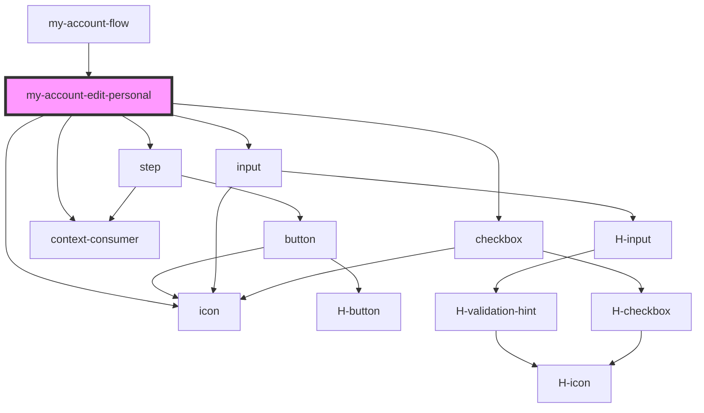

# my-account-edit-personal-info

<!-- Auto Generated Below -->

## Properties

| Property              | Attribute               | Description                                               | Type                                 | Default     |
| --------------------- | ----------------------- | --------------------------------------------------------- | ------------------------------------ | ----------- |
| `disableActionButton` | `disable-action-button` | Handle disabling of back button                           | `boolean`                            | `false`     |
| `getFormVariable`     | --                      | Returns the value for a form variable - used by Tunnel    | `(key: string) => any`               | `undefined` |
| `loading`             | `loading`               | Control loading indicator for step                        | `boolean`                            | `false`     |
| `setFormVariable`     | --                      |                                                           | `(key: string, value?: any) => void` | `undefined` |
| `stepToAutoLoad`      | `step-to-auto-load`     | Controls changeStep event and focuses to passed component | `string`                             | `''`        |
| `subscribed`          | `subscribed`            |                                                           | `boolean`                            | `undefined` |

## Events

| Event                  | Description | Type               |
| ---------------------- | ----------- | ------------------ |
| `cancelled`            |             | `CustomEvent<any>` |
| `emailPermissionEvent` |             | `CustomEvent<any>` |

## Dependencies

### Used by

- [my-account-flow](../my-account-flow)

### Depends on

- [step](../step)
- [input](../input)
- [icon](../icon)
- [checkbox](../checkbox)
- context-consumer

### Graph

---

_Built with [StencilJS](https://stenciljs.com/)_
