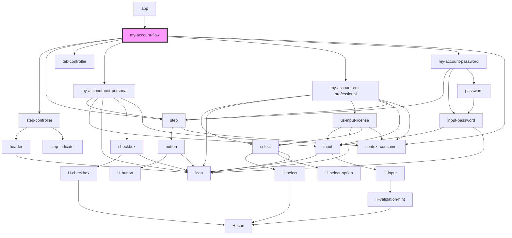

# my-account-flow

<!-- Auto Generated Below -->

## Events

| Event           | Description                                | Type                         |
| --------------- | ------------------------------------------ | ---------------------------- |
| `closeModal`    |                                            | `CustomEvent<any>`           |
| `FlowCompleted` |                                            | `CustomEvent<any>`           |
| `FlowStarted`   | Events to handle flow start and completion | `CustomEvent<any>`           |
| `HEvent`        | Events                                     | `CustomEvent<HEventPayload>` |

## Methods

### `close() => Promise<void>`

Closes the flow

#### Returns

Type: `Promise<void>`

## Dependencies

### Used by

- [app](../app)

### Depends on

- [step-controller](../step-controller)
- [step](../step)
- [tab-controller](../tab-controller)
- [my-account-edit-personal](../my-account-edit-personal)
- [my-account-edit-professional](../my-account-edit-professional)
- [my-account-password](../my-account-password)
- context-consumer

### Graph

---

_Built with [StencilJS](https://stenciljs.com/)_
