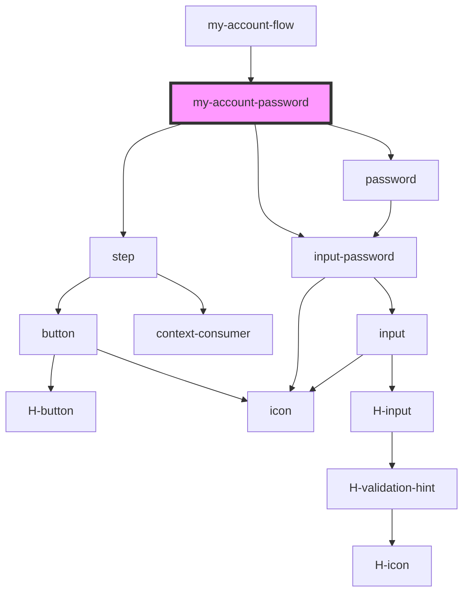

# my-account-password

<!-- Auto Generated Below -->

## Properties

| Property         | Attribute           | Description                                               | Type      | Default |
| ---------------- | ------------------- | --------------------------------------------------------- | --------- | ------- |
| `loading`        | `loading`           | Control loading indicator for step                        | `boolean` | `false` |
| `stepToAutoLoad` | `step-to-auto-load` | Controls changeStep event and focuses to passed component | `string`  | `''`    |

## Events

| Event         | Description | Type                         |
| ------------- | ----------- | ---------------------------- |
| `cancelled`   |             | `CustomEvent<any>`           |
| `editClicked` | Events      | `CustomEvent<any>`           |
| `HEvent`      |             | `CustomEvent<HEventPayload>` |

## Methods

### `clear() => Promise<void>`

#### Returns

Type: `Promise<void>`

## Dependencies

### Used by

- [my-account-flow](../my-account-flow)

### Depends on

- [step](../step)
- [input-password](../input-password)
- [password](../password)

### Graph

---

_Built with [StencilJS](https://stenciljs.com/)_
